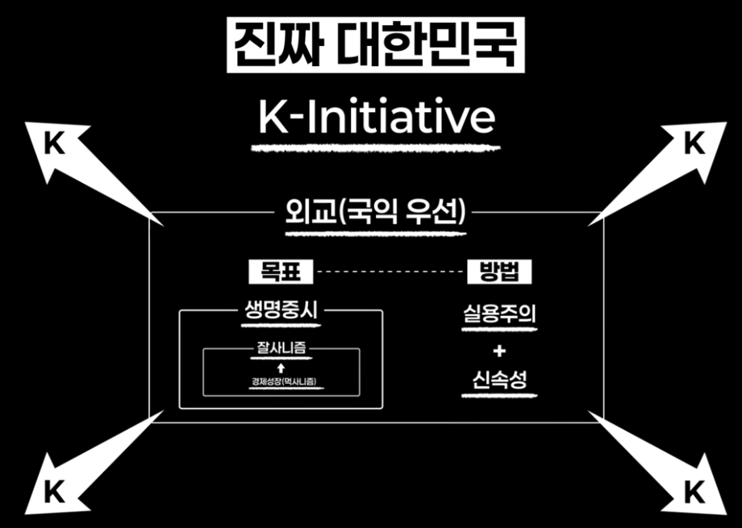

## 위대한 대한국민의 훌륭한 도구가 되겠습니다

대한민국 민주주의의 위대함은 헌법이라는 그 제도에 있는 게 아니라 그 제도를 가지고 사는 우리 국민 스스로의 위대함이죠. 억압하면 포기하고 좌절하고 굴복하는 것이 아니라 결국 그걸 이겨내요. 역사에서 그렇게 보여줬던 거죠. 정말 진정한 의미의 민주적 국가를 훼손하려는 그들의 시도에 대해서 끊임없이 저항해 왔어요. 이번에도 저항한 거죠. 강력한 무력을 동반한 현실적 권력을 끌어내렸지 않습니까. 저는 우리 국민들의 위대함이 대한민국 위대함의 원천이라고 생각합니다. 아마도 세계사에 남을 일이 될 겁니다. 근데 겨울이 너무 길고 깊었어요. 근데 그 길고 깊은 겨울을 결국은 우리 국민들이 깨고 나오는 중이잖아요. 아마 겨울이 깊었던 것처럼 봄은 더 따뜻하겠죠. 따뜻한 봄날을 한번 꼭 만들었으면 좋겠습니다.

대립·갈등이 지금 아주 크죠. 그런데 그 원인은 뭐냐. 여러 가지가 있어요. 아주 근본적인 것은 경제적인 겁니다. 먹고 살기가 어려워져서 그래요. 세상 사는 게 힘들어서 그렇습니다. 그런데 왜 더 잘살게 되었는데 부족하게 됐냐. 편중됐기 때문이죠. 소위 양극화, 불평등, 격차, 이게 너무 커졌어요. 우리 사회가 총량으로는 과거보다는 더 많은 걸 가지고 있게 됐는데 개별적으로 보면 그게 너무 많이 한 군데에 몰려있어요. 그런데 이게 사실은 갈등의 원인이죠.

### 목표: 경제성장

지금 우리 경제는 여러 면에서 일종의 사면초가 같은 상태인 것 같습니다. 전 세계적으로 성장률 전체가 떨어지고 있어요. 그리고 경제는 사실 민간 영역만으로는 제대로 유지 발전되기 어려워요. 정부 영역의 역할이 중요한데 지금 거의 3년 동안 정부는 경제를 방치해 두고 있죠. 이제는 첨단 과학기술에 대한 투자가 중요한 시대가 됐습니다. 근데 문제는 과학기술의 수준이 너무 높아져서 개별 기업들이 감당할 수 없는 상황이 되었어요. 그래서 정부 단위의 인력 양성, 또 대대적인 기술, 연구개발 투자, 스타트업이나 벤처기업에 대한 대규모 투자, 그렇게 하면 다시 또 살아날 수 있습니다. 우리 너무 좌절할 필요는 없는 거죠.

### 목표: 잘사니즘←경제성장(먹사니즘)

먹고사는 문제가 가장 중요하다, 이거는 사실은 매우 기능적이고 물질적인 거예요. 고통스럽게 살지 않게 해줘야 한다. '잘 산다'라고 하는 것이랑은 좀 달라요. 잘사니즘이라고 하면 좀 더 가치지향적이고, 좀 더 정신적이고 고통 없는 삶을 넘어서 더 행복한 삶을 살 수 있는 세상을 만들자 그런 거라고 봐주시면 되겠습니다.

### 방법: 실용주의

정치라고 하는 것은 현장이죠. 현장에서 국민들의 삶을 놓고 실제로 그 삶을 결정하는 거예요. 그게 빨간색이냐 파란색이냐 아니면 어떤 방법이, 정책이, 누구의 생각에서 시작된 것이냐. 그건 특별한 의미가 없죠. 어떤 게 더 유용하고 어떤 게 더 필요하냐. 이게 최고의 기준이 되어야 한다.

### 방법: 실용주의 + 신속성

제가 정한 원칙이 있어요. 대개 공직자들의 태도를 보니까 중요하고 큰 일을 고민하느라고 작아 보이는 일들을 미뤄둬요. 그러니 엄청나게 쌓여요. 공직자는 백만 명이 걸린 일이냐, 백 명이 걸린 일이냐 하면, 만 배로 중요한 일이라고 생각하지만 백 명이 걸린 일조차도, 그 백 명은 목숨이 걸린 거예요. 그래서 모든 일이 다 중요하니 작고 쉽고 간단해 보이는 일을 최대한 빨리 해치운다. 그렇다고 큰 일을 안 한 건 아니에요. 그건 그거대로 고심하고 있죠. 저는 제 업무 책상에 서류가 쌓여있지 않아요. 안 쌓아 놓습니다.

### 목표: 생명 중시

재난이나 사회적 위기 때 피해를 입는 것은 힘겹고 못 살고 어려운 사람 순이에요. 사실 그 사회의 문화 수준이랄까. 그 사회에 대한 평가는 약자들에 대해서 얼마나 많이 관심 갖고 지원하느냐에 달려있어요. 생명, 안전을 유지해야 그다음 단계 더 나은 삶, 행복한 삶을 꿈꿀 수 있어요. 그래서 국민의 생명과 안전을 지키는 것은 정부가, 국가가 해야 할 가장 중요한 일입니다. 뭐든지 문제를 생각해 보면 우리가 조금 더 신경 썼더라면 막을 수 있던 사고로 보여져요. 누가 얼마나 체계적으로 신속하게 대응하느냐에 따라서 피해는 매우 적을 수도 있어요.

### 외교(국익 우선)

현실적으로 보면 한미동맹 매우 중요하고 한미일 협력관계도 매우 중요하죠. 그 속에 일관되는 원칙은 대한민국의 국익이 최우선이다. 거기에 따라 판단하면 되겠죠. 경쟁할 영역은 경쟁하고, 협력할 영역은 협력하고, 또 서로 갈등할 영역은 잘 조정하는 거죠. 특히 이제는 국가 간 경쟁이 사실 기업 간 경쟁과 거의 같아졌습니다. 기업과 정부의 역할 분담, 협력이 정말로 중요해요. 특히 국제 경쟁에서는 반드시 필요한 부분입니다.

### K-이니셔티브

김구 선생이 정말 우리가 먹고사는 것조차 해결하지 못하는 그 시대에 우리가 꿈꾸는 나라는 문화가 강한 나라다. 문화 강국 얘기를 하셨어요. 저는 정말 우리의 역량을 통찰한 정말 혜안이었다. 지금 문화 영역에서는 정말 세계를 상당 부분 선도하고 있지 않습니까. 그걸 우리 K-컬처, 한류라고 부르지 않습니까 근데 여기에 더해서 이제는 K-민주주의 아마 이번 두 번에 걸친 촛불혁명 빛의 혁명을 통해서 무혈의 평화 혁명으로 현실 권력을 끌어내리는 세계사에 없는 일들이 민주주의의 이름으로 이뤄졌잖습니까. 정말로 위대한 민주주의의 힘을 보여준 거죠. 대한민국이 세계를 선도하는 여러 영역들이 있다고 봐요. 처음에 이런 것들을 K-이니셔티브라고 통칭하고 싶습니다. 우리가 비록 규모는 적지만 소프트파워 측면에서는 세계를 여러 영역에서 선도할 수 있겠다는 생각이 들어요. 그런 나라 한 번 꼭 만들어보고 싶어요.

### 진짜 대한민국

대한민국이라고 하는 이 국호. 국호에는 정말 큰 뜻이 담겨있죠. 민국, 국민의 나라, 민중의 나라, 이 '민'자는 백성이죠. 흰 옷입은 사람들. 평범한 사람들. 평범한 사람들의 나라 그리고 작지만 큰 나라죠. 많은 사람이 희망을 가지고 행복한 삶을 꿈꾸는 그런 세상이 봄날 아니겠어요. 진짜 대한민국을 만들고 싶습니다. 그냥 이름만 있는 대한민국이 아니라 진짜 대한민국. 그리고 그 대한민국은 대한 국민이 만들어 가는 거죠. 그 대한 국민의 훌륭한 도구. 최고의 도구, 이재명이 되고 싶습니다. 진짜 대한민국을 만들기 위해 대통령 선거에 출마합니다.

