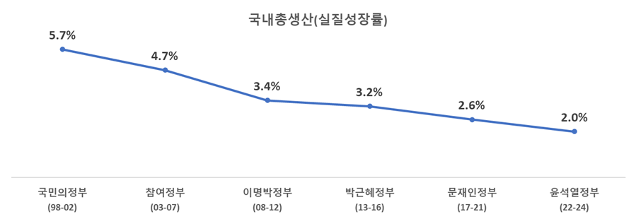

## 1. 비전·목표
- 일하는 사람이 주인공인 나라, 노동이 존중받는 사회
  - 일하는 사람이 주인공인 나라 -> 일하는 사람 모두의 권리가 보호된다
  - 노동이 존중받는 사회 -> 노동에 대한 합당한 보상이 이루어진다

## 2. 현황 및 문제점
- 현황: 노동의 새로운 도전
  - 저성장
<div style="text-align: left;">
  
</div>

  - 산업 대전환
    - 기술발전: 인공지능, 빅데이터, 로봇, 바이오 기술 등을 중심으로 기술 융복합과 혁신이 빨라지고 있음
    - 산업구조 변화: 인공지능, 데이터 등 디지털 기술 기반의 고부가가치 서비스업 및 첨단기술 산업, 그리고 저탄소·친환경 산업 중심으로 빠르게 재편되고 있음
  - 플랫폼노동과 특수고용 등 비전형 노동자 증가
    - < 플랫폼종사자 실태조사 결과(한국고용정보원) >  

||21년|22년|23년|
|:-:|:-:|:-:|:-:|
|**합계**|**66.1**|**79.5**|**88.3**|
|배달·운전|50.2|51.3|48.5|
|교육·상담 등 전문서비스 |5.3|8.5|14.4|
|컴퓨터 단순 작업|3.1|5.7|8.7|
|가사·돌봄|2.8|5.3|5.2|
|디자인 등 창작활동|1.9|3.6|5.0|
|SW개발 등 IT서비스|1.4|1.7|4.1|

- 문제점
  - 일자리 감소에 따른 대량 실업 발생 우려
  - 비전형노동자를 보호하지 못하는 노동법 사각지대 증가

## 3. 기본 방향
- 고용노동부의 정책 대상 확대: 근로자 → 일하는 사람
- 일하는 사람의 실질적인 권리 보장: 산재예방, 사회보장, 차별·괴롭힘 방지 등 제도 개선
- 노동권 보호 시스템 구축: 지방자치단체 공무원에게 노동 관련 특별사법경찰권 부여, 노동위원회 기능 강화, 노동법원 설치

## 4. 주요 과제

### (1) 일하는 사람 기본법 제정

#### 일하는 사람 기본법의 의의
- 일하는 사람 전체에 대한 보호 체계를 만드는 것은 기존의 사용자-근로자 개념에 기초한 노동관계법 체계 전체를 다시 설계하는 작업으로 이해해야 함
  - 일하는 사람의 개념과 범위
  - 일하는 사람이 보호받아야 할 권리의 범위(=사업주를 대신할 국가의 책임 범위)
  - 일하는 사람 보호를 위한 예산, 조직·인력, 정보 시스템의 문제
  - 일하는 사람을 보호하기 위한 지원사업 및 서비스 전달체계
  - 근로자 보호 체계와의 중복성 문제

#### 정책 과제

- 일하는 사람을 실질적으로 보호하기 위해서는 전담 부서를 설치하고, 보호 체계를 설계해야 함
  - 첫 번째 작업은 일하는 사람 기본법 제정안 마련
  - 이후 하위 법령과 사업 예산 확보, 전달체계 구축 및 데이터 축적을 위한 전산시스템 구축 등 후속 조치 필요
  - 일하는 사람의 변화를 모니터링 하기 위한 민관협력 기구도 구성해야 함

```
- 일하는 사람 기본법 주요 내용
  - 대상 확대: 근로자 → 일하는 사람
  - 권리보호 강화: 사업주가 분명하지 않거나 존재하지 않는 경우 보호주체로서 국가의 역할 정립
  - 지원방안: 사회안전망 가입, 노후소득 보장, 공제사업 지원, 상담서비스 제공 등
```

### (2) 노동위원회의 조정 기능 강화

#### 노동위원회 개요
- 노동위원회는 노·사·공익 3자로 구성된 준사법적 성격을 지닌 합의제 행정기관
  - 설립목적: 노동관계에서 발생하는 노사간의 이익 및 권리분쟁을 신속하고 공정하게 조정·판정하여 산업평화 정착에 기여
#### 필요성: 노동위원회 조정 기능 강화 
- 노사간의 대립되는 주장 중 일부를 인정하고 나머지 주장을 배척하는 방식은 노사가 분쟁 해결 이후에도 '사업주-근로자' 관계를 유지하며 함께 일해야 한다는 점을 고려하면 최선의 방식이라 보기 어려움
- 사업장 내의 문제를 모두 갈등관계로 파악한다면, 구성원들이 자율적인 화해와 조정을 통해 해결할 수 있는 일들까지도 근로감독관의 개입을 요청하게 됨
- 사업장 내의 노사협의회 등을 통해 자율적으로 조정하는 것이 가장 바람직하지만, 상당수의 사업장은 조정 경험이 없다는 현실적인 문제가 존재함
- 노동위원회의 공익위원과 같은 객관적인 제3자가 쌍방의 주장을 들어 조정하고, 이를 노사가 수용하도록 하는 것이 바람직한 접근 방법이라고 봄
- 특히, 직장 내에서 발생하는 직장내 괴롭힘, 성희롱, 차별 등은 주관적인 경험이기 때문에 아무리 근로감독관이라 하더라도 사실관계를 정확히 파악하기 어렵고, 어렵게 사실관계를 파악해서 결론을 내린다 하더라도 쌍방이 모두 수용하는 경우는 거의 없음
- 물론 근로감독관이 사실관계를 파악하여 상대방을 처벌할 필요가 있는 경우도 존재하지만 그 단계까지 가기 전에 노동위원회의 조정을 필수적으로 거치도록 하여 가급적 조정 단계에서 문제가 해결될 수 있도록 하는 것이 지속가능한 조직문화 형성을 위해 바람직함
#### 정책 과제  
- 법령 개정 등을 통해 기존에 수행하고 있는 조정 및 차별시정 업무 외에 직장내 괴롭힘, 직장내 성희롱 사건 등 조정 필요성이 높은 사건은 노동위원회의 조정을 우선적으로 거치도록 할 필요
  - 이를 위해 노동위원회의 조정 업무를 수행하는 조직·정원을 확충해야 함
- 노동위원회 조정 관련 조직·인력 현황
  - 중앙노동위원회에 5개의 조정위원회, 중앙노동위원회 사무처에 1과(조정과) 12명, 지방노동위원회에 12과(독립7, 겸임5) 운영 중
    - 중앙노동위원회 조정위원회(총 5개): 조정위원회, 특별조정위원회, 중재위원회, 교원노동관계조정위원회, 공무원노동관계조정위원회

### (3) 배달 노동자 보호 강화

#### 현황 및 문제점
- 배달노동자들은 플랫폼의 배달료(수수료)를 통해 생계를 유지하는데, 자신의 배달료가 어떻게 결정되는지에 대해서 알고 있지 못함
  - 플랫폼이 수수료를 산정하는 알고리즘은 기업의 영업비밀이라는 이유로 또는 블랙박스 방식이라 자신들도 정확히 설명할 수 없다는 이유로 공개되지 않음
  - 노동자들은 비슷한 거리와 조건인데도 배달료가 다르게 책정되거나, 예상보다 낮은 배달료가 책정되는 경우 차별을 당한다고 인식함
  - 또한, 플랫폼 사업자가 프로모션을 시행하거나 수수료 체계 부담을 변경하면서 배달노동자에게 부담을 전가하더라도, 배차에 불이익을 받거나 배달료를 낮게 받을 수 있다는 걱정 때문에 사실상 강제적으로 수용할 수 밖에 없다는 문제를 제기
- 배달노동자는 법령에서 정한 책임보험에 가입할 수는 있지만 보장범위가 좁고, 보험료가 비싸 현실적으로 가입이 어려움
  - 울며 겨자먹기로 다수의 배달노동자가 무보험으로 운행
- 산업안전보건법에 따라 배달노동자의 노무를 제공받는 업체는 안전보건교육 실시, 오토바이 정비 상태 확인, 보호구 착용 지시, 고객폭언 대응 지침 제공 등의 의무를 이행해야 하나,
  - 현실에서는 형식적인 조치만 취해지고 있음

#### 정책 과제
- 플랫폼의 배달료 산정 방식 공개 방안 마련
- 플랫폼과 배달노동자 간의 계약조건 변경 절차 마련
  - 당사자의 동의없이 계약조건이 불리해지는 경우가 발생하지 않도록 제도 개선
- 배달노동자가 업무 중의 사고로 회복하기 어려운 상황에 처하지 않도록 보험 가입 등 지원 방안 마련
- 미조직 취약 노동자 권익보호를 위한 근로자이음센터 확충 및 상담 서비스 제공
- 미조직 취약 노동자 정책 수립 및 이행을 위한 예산 및 조직·정원 확보

### (4) 노동조합을 통한 노동권 보호 강화

#### 노동조합법 개정안(노란봉투법) 취지

- 간접고용이 확대되면서 하청업체의 근로자들은 원청업체의 결정에 따라 근로조건이 결정되지만, 사용자-근로자 관계가 성립하지 않는다는 이유로 단체교섭권을 행사하지 못함
- 노동조합, 근로자가 쟁의행위 과정에서 끼친 손해에 대해 사용자가 과도한 손해배상 소송 및 가압류를 제기하여 헌법이 보장하는 노동3권의 행사가 제약됨
- 이에 근로자들이 노동조합법의 쟁의행위를 통해 근로조건을 개선할 수 있도록 쟁의행위를 폭넓게 인정하고, 쟁의행위에 참여한 근로자에 대한 사용자의 손해배상 청구를 제한하려는 것임

#### 주요 내용

##### 제2조
- 사용자 범위 확대: 근로계약 체결 당사자 외에 근로자의 근로조건에 대하여 실질적이고 구체적으로 지배·결정할 수 있는 지위에 있는 자도 사용자로 봄
- 근로자 아닌 자의 노동조합 가입 허용
- 노동쟁의 대상 확대: 근로조건의 결정에 관한 사항 → 근로조건에 관한 사항

##### 제3조 
- 단체교섭, 쟁의행위, 그 밖의 노동조합의 활동으로 인하여 입은 손해에 대해서는 손해배상 청구 금지
- 사용자의 불법행위에 대하여 노동조합 또는 근로자의 이익을 방위하기 위하여 부득이 사용자에게 손해를 가한 경우 배상책임 면제
- 법원이 손해배상책임을 인정하는 경우, 각 배상의무자별로 각각의 귀책사유와 기여도에 따라 개별적으로 책임 범위를 정하도록 함
- 신원보증인은 쟁의행위 등으로 인하여 발생한 손해에 대하여 배상책임 면제
- 사용자가 단체교섭, 쟁의행위, 그 밖의 노동조합의 활동으로 인한 노동조합 또는 근로자의 손해배상 책임을 면제할 수 있도록 함

#### 정책 과제
- 현행 노동조합법 개정안이 그대로 시행되면 근로관계가 없더라도 실질적 지배력이 있기 때문에 사용자라고 주장하면서 교섭을 요구할 수 있음
- 또한, 노동조합과 근로자에 대한 손해배상 책임이 극히 제한되기 때문에 쟁의행위 과정에서 손해를 끼치지 않으려고 노력할 유인이 거의 없음
- 이러한 우려가 현실화하지 않도록 하면서, 노동조합법 개정안의 취지를 살릴 수 있는 절충안을 마련할 필요

### (5) 근로자의 날 법 개정
- 근로자의 날 제정에 관한 법률을 개정하여 '근로자의 날'을 '노동절'로 변경

### (6) 중장년 고용 정책

#### 현황 및 문제점
- 법적 정년(60세)와 국민연금 수급(65세) 사이의 단절 발생
- 저출산·고령화에 대응하기 위해서는 40·50 중장년과 60+ 고령층의 노동력을 활용할 필요
- 퇴직이후의 삶이 준비되지 않은 상태에서의 은퇴는 노인빈곤의 주된 원인

#### 정책 과제
- 정년연장과 임금체계 개편의 병행 추진
  - 중장년과 고령층의 노동력을 활용한다는 측면에서는 정년연장 또는 계속고용이 필요하지만, 연공급에 기초한 높은 임금을 계속 지급하기는 어렵기 때문에 노동생산성을 반영할 수 있는 임금체계 개편을 병행할 필요
  - 경제사회노동위원회 등을 통해 노-사-정 사회적 대화를 실시하고, 합의안 도출
- 노후소득 보장을 위한 퇴직연금 제도 개편
  - 국민연금 만으로 노후소득을 보장하기 어려운 상황에서 퇴직연금 제도 개선을 통해 근로자의 노후생활을 보호할 필요
  - 퇴직연금 의무화, 세제 지원 강화, 중소기업퇴직연금기금 지원 확대 등 
  - 적립금이 430조에 달하는 퇴직연금제도가 제 기능을 할 수 있는 규모의 추진체계를 구축해야 함
    - 현재 고용노동부에는 전담부서 없이 퇴직연금 담당자(4명)만 존재
    → 전담부서 2과(퇴직연금정책과, 퇴직연금제도운용과) 및 퇴직연금관리공단 신설

### (7) 청년 고용 정책
#### 청년미래적금(청년내일채움공제 시즌2) 신설
- 악화되는 청년 취업 통계
  - 청년층(15~29세) 고용보조지표3(확장실업률)은 '24년 16.0%로 '23년 15.5%에 비해 0.5% 증가
  - 청년층(15~29세) 쉬었음 인구는 '24년 41.1만명으로 '23년 36.6만명에 비해 4.5만명 증가
- 청년내일채움공제는 청년고용 개선세 등을 고려하여 '21년 이후부터 단계적 축소, '24년부터 신규가입 종료
- 청년미래적금, 청년내일채움공제 등 신설 추진 필요

#### 생애최초 자발적 이직자에 대한 구직급여 지급
- 구직급여는 비자발적 이직자가 구직활동을 할 때 구직급여를 지급하는 제도이나, 청년층에 한하여 생애 1회 자발적 이직을 하더라도 구직급여를 지급하는 방안 추진

### (8) 상병수당 제도 확대 적용

- 저소득자를 대상으로 시범사업 진행 중인 상병수당 확대 방안 검토(복지부)