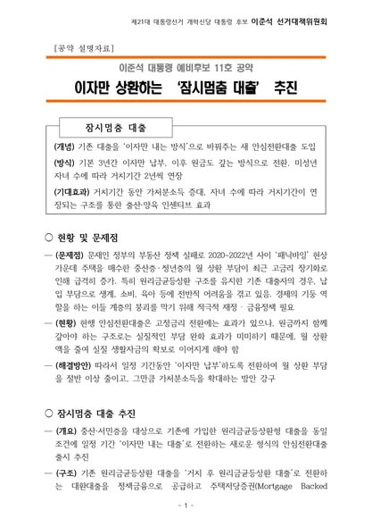
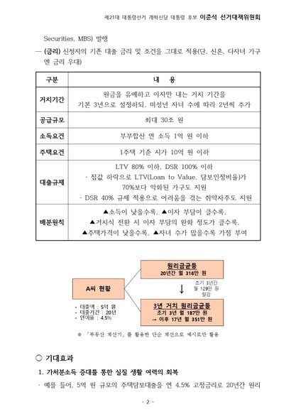
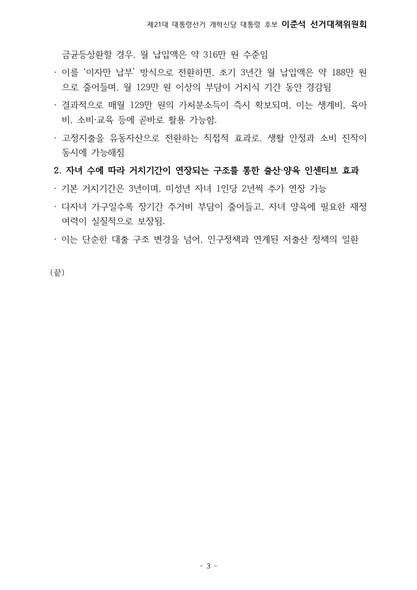
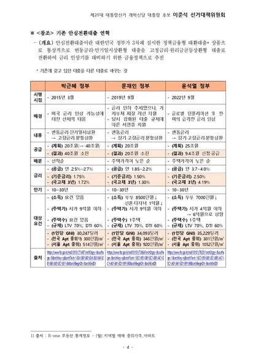

지금 대한민국의 젊은 세대는 월급을 받아도 쓸 돈이 없습니다. 세금과 사회보험료를 제하고 나면, 남은 소득의 상당 부분이 주택담보대출 원리금 상환에 들어갑니다.  

이런 구조에서는 외식 한 번, 아이 학원비 한 번도 부담스럽습니다. 소비가 얼어붙고, 소상공인 자영업자들도 함께 어려워지는 악순환이 벌어지고 있습니다.  

과거에는 주택담보대출을 받을 때 5년 이상 거치기간을 둘 수 있는 경우가 흔했습니다. 일부는 10년까지도 가능했습니다. 하지만 지금은 거치기간이 아예 없거나, 있어도 1~2년으로 매우 짧습니다. 주택을 마련하자마자 곧바로 무거운 상환의 굴레에 들어가게 되는 구조입니다.  

그래서 저는 제안합니다. 주택담보대출 거치기간을 최소 3년으로 보장하고, 아이를 낳을 때마다 2년씩 추가 연장할 수 있도록 제도를 바꾸겠습니다.  

이렇게 되면 육아와 생계로 가장 돈이 많이 드는 시기에 원금 상환 부담을 줄일 수 있습니다. 결과적으로 젊은 부모들의 가처분 소득이 늘어나고, 소비 여력도 생깁니다. 더 나아가 출산과 양육을 주저하게 만드는 경제적 요인을 줄여, 출산율 문제 해결에도 기여할 수 있습니다.  

집은 샀는데 삶은 더 팍팍해졌다는 이야기가 더는 나오지 않도록 하겠습니다. 청년이 숨 쉴 수 있는 정책, 아이를 키울 수 있는 정책으로 보답하겠습니다.

