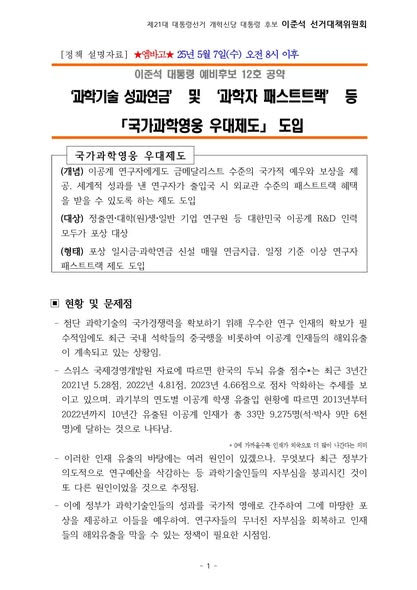
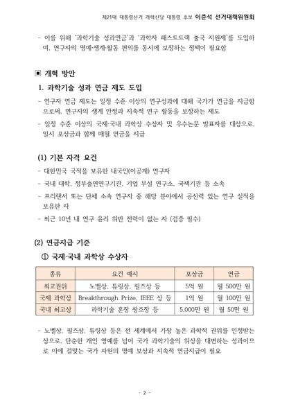
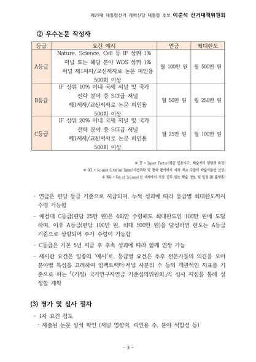
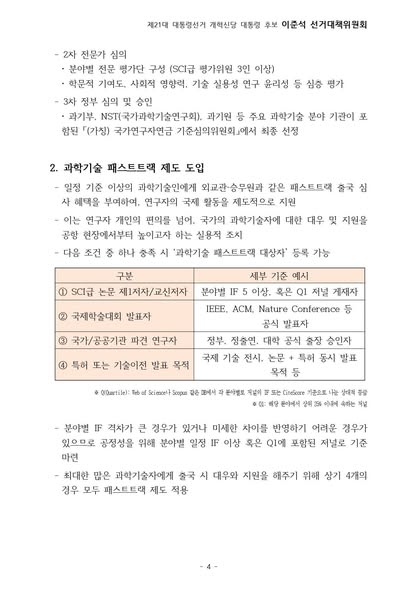

이제 대한민국이 한 단계 더 도약할 수 있을지, 아니면 장기적 침체의 늪에 빠질지는 중국이나 미국과의 과학기술 패권 경쟁의 결과에 달려 있습니다.  

이를 위해 가장 중요한 것은 과학기술 인력이 연구에 온전히 집중할 수 있고, 사회로부터 충분히 존중받는 환경을 만드는 일입니다.  

저는 체육인에게 주어지는 체육연금, 즉 ‘경기력향상연구연금’과 같이, 우수한 과학기술인에게도 국가 차원의 보상 체계가 필요하다고 생각합니다.  

현재 기관이나 대학 등에 소속된 연구자들은 뛰어난 연구 성과를 통해 개인적인 명예를 얻지만, 정작 연구에 집중할 수 있는 실질적 보상은 기관의 여건에 따라 천차만별입니다.  

이에 따라, 공인된 학술지에 탁월한 성과를 발표했거나 권위 있는 상을 수상한 연구자에게는 올림픽 금메달리스트에 준하는 수준으로 국가가 직접 포상하는 제도를 도입하고자 합니다.  

또한 국제 학술 교류와 공동연구를 촉진하고, 과학기술인을 사회적으로 우대하는 분위기를 조성하기 위해, 현재 공항에서 일부 비즈니스맨이나 고위 관료에게 제공되는 패스트트랙 제도를 국제 연구활동에 참여하는 과학기술인에게도 확대 적용하겠습니다.  

“우리 엄마는 과학자야”, “우리 아빠는 공항에서도 우대받는 연구자야”라는 말을 자녀들이 자랑스럽게 할 수 있는 사회—  
그런 사회를 만들기 위해, 저는 과학기술 패권 경쟁의 최전선에 선 연구자들에 대한 지원과 포상을 과감히 확대해 나가겠습니다.

