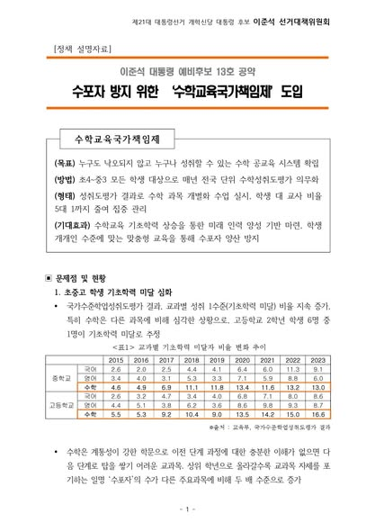
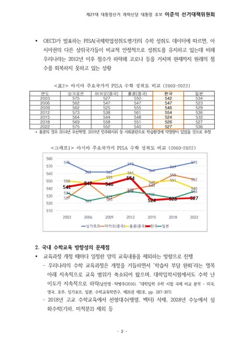
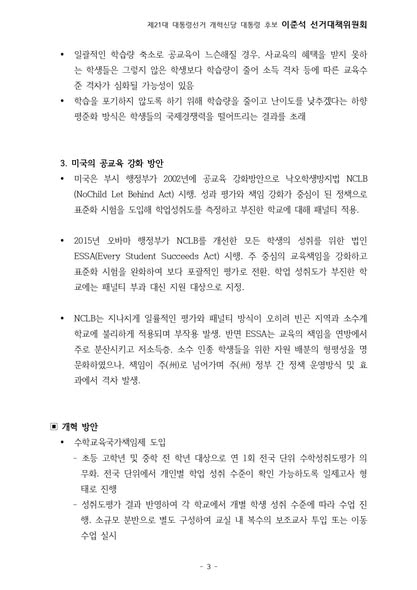
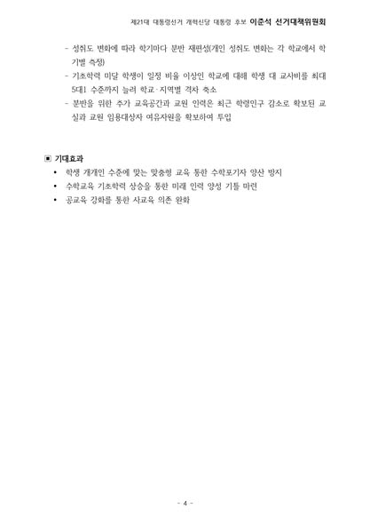

"아이가 수학을 포기한 날, 부모는 미래에 대한 걱정을 시작합니다."  

수학은 단지 한 과목이 아닙니다.  
기초학력이 무너지면, 기회의 문도 함께 닫힙니다.  
AI를 말하고, 반도체를 말하지만 정작 그 바탕이 되는 수학은 지금 붕괴 중입니다.  

국제학력평가(PISA)에서 한국은 아시아 주요 국가 중 유일하게 수학 성취도가 지속적으로 하락했습니다.  
최근 고등학생 6명 중 1명이 수학 기초학력조차 부족하다는 조사 결과도 나왔습니다.  
이제는 ‘수포자’라는 말이 너무 익숙해진 나라가 되어버렸습니다.  

학원에 보내야만 따라갈 수 있는 교육.  
따라가지 못하면 아예 포기해버리는 현실.  
이게 과연 공교육이 책임져야 할 모습일까요?  

저는 ‘수학교육 국가책임제’를 도입하겠습니다.  

초등학교 4학년부터 중학교 3학년까지, 매년 전국 단위 수학 성취도 평가를 실시하겠습니다.  
학생 개개인의 수준에 맞는 수업이 가능하도록 소규모 분반을 운영하겠습니다.  
학생 5명당 교사 1명까지 배치해, 다시 시작할 수 있도록 손잡아주겠습니다.  
학령인구 감소로 생긴 여유 교실과 교원 인력을 활용해 실현 가능한 개혁을 시작하겠습니다.  

공부는 누구에게나 공평해야 합니다.  
가정형편이 수학 실력의 격차로 이어지지 않도록, 사교육이 아닌 공교육이 아이들을 지켜내야 합니다.  

누구도 낙오하지 않고, 누구나 성취할 수 있는 수학교육.  
저는 그것이 미래산업으로 가는 진짜 첫걸음이라고 믿습니다.  

우리 아이들이 "나는 수학을 포기하지 않았어"라고 말할 수 있도록.  
이제 공교육이 다시 책임지겠습니다.

