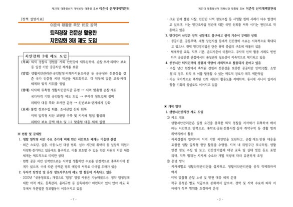
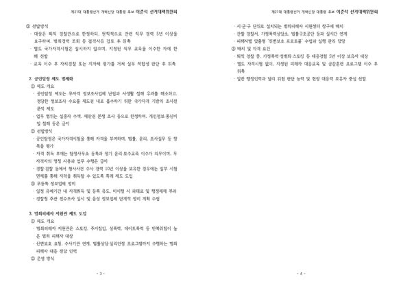

공무원으로 일정기간 국가를 위해 봉사하면 그 분야의 전문성을 인정받아 관련 분야의 전문자격증을 쉽게 취득할 수 있는 제도가 있습니다.  

세무공무원은 세무사, 보편적 공무원은 행정사, 특허청 근무 공무원은 변리사 등의 자격 취득에 있어 혜택을 받습니다.  

14만명이 넘는 경찰공무원들은 우리나라의 최일선에서 치안과 생활안전 수사등을 담당해 충분한 전문성이 있음에도 행정사 이외로 전문성을 활용할 수 있는 이런 혜택이 부족했습니다.  

퇴직후에도 경찰공무원의 전문성을 바탕으로 공인탐정 자격증을 취득할 수 있게 하고 생활치안관리관으로 지역의 치안에 지속적인 기여를 할 수 있도록 하겠습니다.  

경찰공무원의 전문성이 퇴직이후에도 국민을 위해 쓰일 수 있기를 바라며 공약을 만들었습니다.  

많은 관심 부탁드립니다.

