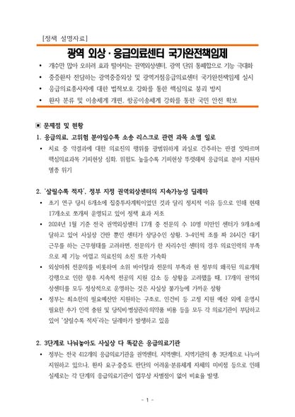
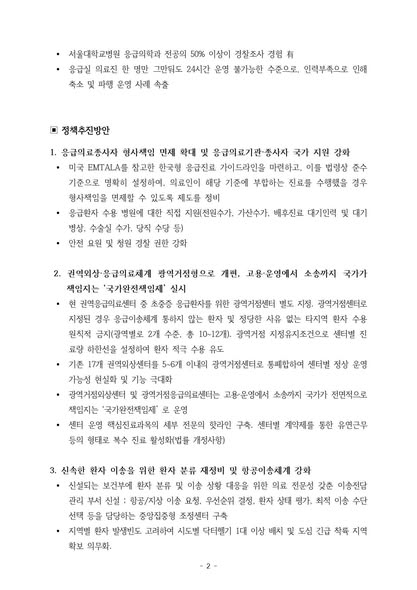
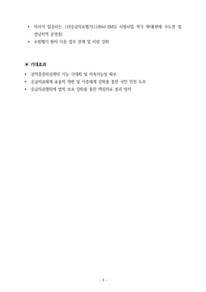

윤석열 정부 시절 튀어나온 수많은 이상한 정책 가운데 가장 이상한 정책이 의대 정원을 갑자기 2천 명 늘리겠다고 한 것입니다.  

원래 3천 명이었던 정원을 갑자기 5천 명으로 2배 가까이 단번에 늘리는 것도 비정상적이거니와, 왜 증원 숫자가 ‘2천’이 되어야 하는지에 대한 아무런 합리적 근거가 없었습니다.  

그저 의사 숫자 많이 늘리면 필수분야 의료 인력이 채워질 것이라는, 말도 안 되는 낙수 이론에 근거한 폭거였습니다. 사람은 물이 아니고, 의사는 하늘에서 떨어지지 않습니다.  

의사들이 중증, 응급, 소아, 분만 등 필수 분야를 기피하는 이유는 여럿이지만, 그중 하나는 걸핏하면 의사의 멱살을 쥐어 잡고 민형사상 책임을 묻는 세태 때문입니다.  

그런 부담을 덜어주지 않는다면 의대 정원을 5천이 아니라 5만 으로 늘린들 아무 소용이 없는 것입니다.  

저는 오늘 응급의료 종사자들의 소송 부담과 형사책임의 범위를 줄여주는 것을 골자로 하는 16호 공약을 발표했습니다.  

중증외상쳬계를 효율적으로 재정비하기 위해 현재 17개로 나뉘어진 권역별 외상센터를 ‘광역 거점 외상센터’로 통폐합하고 국가가 고용과 운영은 물론 소송까지 책임지는 제도 또한 시행하겠습니다. 이국종 국군대전병원장을 만나 뵈었을 때 나누었던 의견을 고스란히 담았습니다.  

의료진에 대한 책임은 가혹하게 물으면서 의료진에 대한 보호에는 한없이 허술한 지금과 같은 상황이 바뀌지 않는다면 드라마 ‘중증외상센터’에 등장하는 풍경은 드라마에서나 가능한 판타지일 따름이라고 저는 단호하게 말한 바 있습니다.  

제2 제3의 이국종도 지금과 같은 환경 속에서는 결코 탄생하지 못할 것입니다.  

각종 전문직 종사자들이 규제와 처벌의 지뢰밭에서 두려워하는 나라에 미래는 없습니다. 의료계부터 자유의 숨통을 열어 놓겠습니다.

