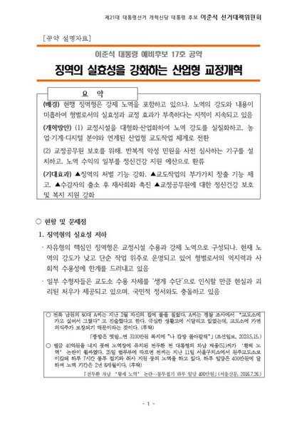
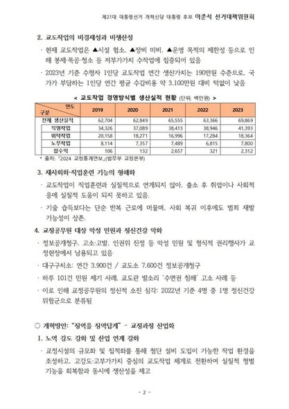
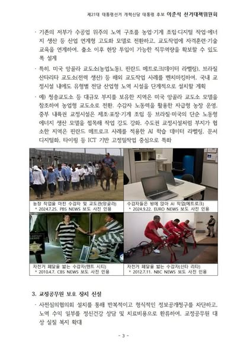

전두환 전 대통령 차남이 벌금 40억 원을 내지 않고 2년 8개월 감옥에 가서 봉투접기 같은 황제 노역으로 시간을 때우고 있다는 소식이 공분을 샀던 적이 있습니다.
일당으로 따지면 매일 400만 원을 벌고 있는 셈입니다.   

이른바 ‘수형자 인권’이란 명목 아래 벌을 받아야 할 사람들에게도 관대하게 대하니 ‘교도소에 가서 얼마간 버티면 된다’고 법과 공권력을 우습게 아는 세태가 이어지고 있습니다.   

법을 잘 지키면서 착실하게 사는 서민들만 손해를 보는 느낌입니다.   

저는 이번에 17호 공약으로 징역의 실효성을 강화하는 산업형 교정 개혁을 실시하겠다고 약속했습니다.   

교정시설에서 노역 강도를 실질화하고, 노역으로 인한 생산가치를 높이는 것입니다.   

2023년 기준으로 수형자 1인당 소요되는 수감 비용은 연간 3,100만 원인데, 그들이 감옥에서 노역으로 생산하는 가치는 190만 원에 불과합니다. 우리가 열심히 일해서 낸 세금으로 감옥의 범죄자들을 따뜻하게 먹여 살리고 있는 셈입니다. 이래서는 교정효과를 기대할 수도 없습니다.   

농업노동을 기반으로 한 미국 앙골라 교도소, 데이터 라벨링 일감을 처리하는 핀란드 교도소, 전력을 생산하는 브라질 산타리타 교도소처럼 교정시설을 산업화해서 부가가치를 높이고 실질적 형벌 기능을 회복하겠습니다.   

또한 현장 교정공무원들의 피로도가 상당합니다. 반복적인 악성민원과 정보공개를 사전 차단하는 심의협의회를 설치하고, 교정공무원의 복지 수준을 향상하기 위한 지속적 노력을 기울이겠습니다.   

법이 준엄해야 사회가 안정을 되찾습니다.

