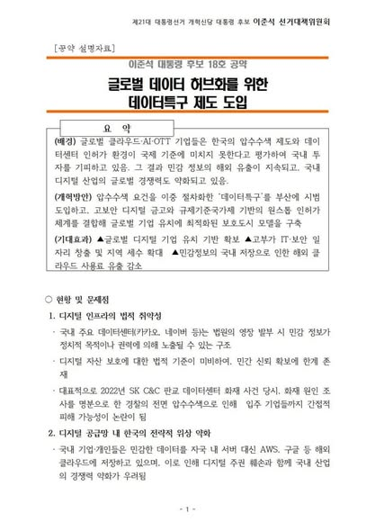
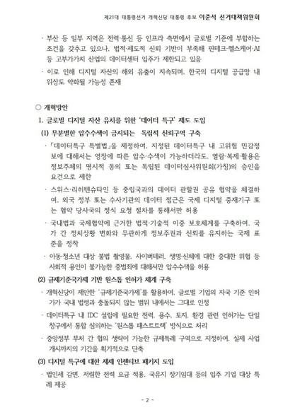
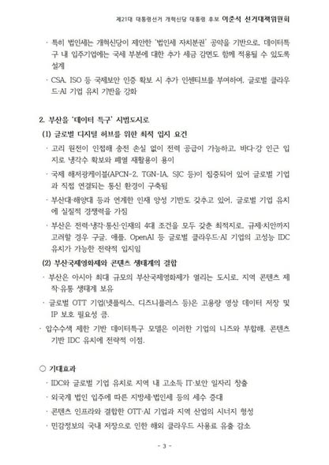

1960년대에 박정희 대통령이 제철소와 고속도로 건설을 통해 산업화 시대를 이끌었다면 지식정보화 시대의 제철소-고속도로는 데이터센터입니다.   
우리가 인터넷 사이트에 어떤 요청을 보내면 그에 따른 응답을 받아볼 수 있습니다. 요청을 보내는 사람이 클라이언트이고, 응답을 만들어 보내주는 주체를 서버라고 합니다. 그 서버가 존재하는 곳이 바로 데이터센터입니다.   

모르는 분들이 많지만, 서버를 가동하고 거기에서 나오는 열을 식히기 위해서는 엄청난 양의 물과 전기가 사용됩니다. 따라서 데이터센터는 물, 전기, 그리고 데이터가 오갈 수 있는 케이블이 이어진 곳이 최적입니다.   

우리나라에 이 3대 요소를 다 갖추고 있는 곳이 있습니다. 부산입니다. 

원전이 가까이 있어 전력자립률이 200%가 넘고, 바다를 품고 있는데다, 해저에 광케이블이 지나갑니다. 더구나 데이터 수요가 높은 일본과도 가깝습니다.   

이런 최적의 요충지 부산을 저는 ‘데이터 수도’로 만들고자 합니다. 이를 위해 저는 ‘데이터 특구 특별법’을 제정해 규제와 조세의 허들을 낮춰주려고 합니다. 제철소와 고속도로를 만들려고 하는 규제가 많아 못 짓고, 세금이 높아 건설업체들이 수주를 꺼린다면 안 되는 일 아니겠습니까.   

18호 공약에 이 부분을 내용으로 담았습니다.   

얼마 전 이재명 후보가 서해안 지역을 해상풍력의 메카로 만들겠다고 했습니다. 전남 해남에는 재생에너지를 기반으로 하는 세계 최대 AI 데이터센터를 구축하겠다고 했습니다. 과학과 기술에 대한 이해도가 아예 없는 망상에 가까운 발언입니다.   

아주 간단하게 말하자면 해남에 해저 케이블이 들어가지 않습니다. 매설을 한다 해도 부산에 비해 경쟁력이 떨어집니다. 더구나 불안정한 재생에너지를 기반으로 하는 곳에 어느 데이터센터가 들어가려고 하겠습니까.   

지방에 가는 곳마다 ‘다 해주겠다’는 식으로 막 던지는 공약은 지양해야 할 것입니다. 각 지역의 조건과 특성에 맞게 현실적인 국가 경영 방안을 제시해야 마땅합니다.   

이재명 후보의 자질은 지적으로나 도덕적으로나 모든 면에서 언제나 의심스럽습니다.   

오는 18일에 경제 분야 TV토론회가 있습니다. 거기서 뵙겠습니다.

